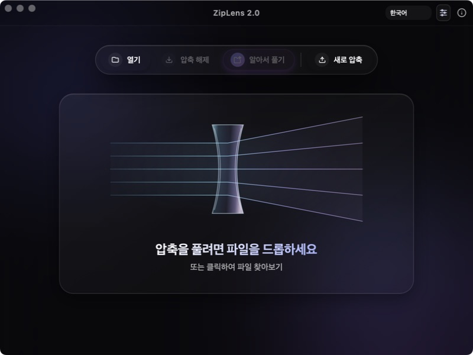
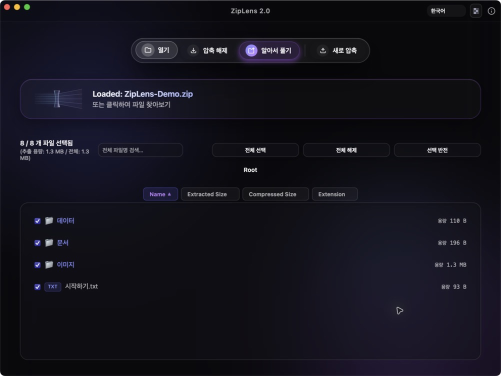

# ZipLens

macOS에서 압축 파일을 미리 보고, 필요한 파일만 골라 풀 수 있는 무료 압축 앱입니다.

현재 프리뷰 버전은 **ZipLens 2.0.1**입니다. ZIP·7Z·TAR 계열 압축 생성, ALZ·EGG 해제, 한글 파일명과 Finder 기본 앱 설정을 지원합니다.

- [2.0 사용법·지원 형식·빌드 방법](ZipLens_Astra/README.md)
- [2.0.1 프리뷰 다운로드](https://github.com/SeederPowerDrop/ZipLens/releases/tag/v2.0.1) — Apple Silicon용, Apple 공증 미완료
- [다운로드 앱 실행 문제와 수정 내용](ZipLens_Astra/docs/MACOS_LAUNCH_KO.md)

> 기존 **2.0.0 프리뷰**에는 Finder에서 파일을 열며 앱을 처음 시작할 때 종료되는 오류가 있습니다. 2.0.1에서 수정했습니다. **이번 2.0.1 프리뷰도 Apple Developer ID 서명·공증을 완료하지 않아 macOS의 ‘손상되어 열 수 없음’ 등 실행 차단은 남을 수 있습니다.** 정식 서명·공증 절차는 별도로 준비되어 있습니다.

## 앱 화면

**메인 화면** — 파일을 끌어 놓아 압축을 열거나, 새 압축 파일을 만듭니다.



**압축 파일 미리보기** — 내부 폴더와 파일, 해제할 용량을 확인하고 원하는 항목을 선택합니다.



실제 macOS 앱에서 촬영했습니다. 미리보기에는 공개용 샘플 자료를 사용했습니다.

## 기존 ZipLens 1.3.0

A modern, universal archive extraction and compression utility built on **Tauri**, **Vanilla TS**, and **Rust**.

## What's New in v1.3.0
- **Lightning-Fast Single File Extraction**: Massively optimized speed when extracting a single file from large archives.
- **Double-click Flat Extraction**: Double-click any file in the preview to instantly extract it directly to the archive's folder and automatically open it.
- **Smart Auto-Renaming**: Prevents accidental overwrites by automatically renaming extracted files (e.g., `file (1).txt`) if a conflict exists.
- **Improved UI & Notifications**: New extraction report dialog with shortcuts to open files/folders, and sleek Toast notifications.
- **Advanced Archive Preview**: View the complete list of files inside an archive *before* extracting them.
- **Partial Extraction**: Selectively check/uncheck files from the preview list. Extract only what you want!
- **Dynamic Capacity Tracker**: See the exact storage footprint of your selected files in real time before extraction.

## Core Features

- **Universal Format Support**: Extract and compress ZIP, TAR, TAR.GZ, TAR.ZST, and 7Z formats directly and natively via Rust.
- **Extended Sidecar Support**: Handles RAR, ALZ, EGG, ISO, CAB, and LZH smoothly using an embedded `7zz` sidecar.
- **Korean Filename Auto-Detection (CP949/EUC-KR)**: Automatically detects and safely decodes non-UTF-8 filenames to prevent text corruption in old ZIP files.
- **Volume Split Compression**: Compress large folders into split volumes (10MB, 100MB, 700MB, 4GB).
- **macOS Quick Actions**: Integrates with "ZipLens로 압축 해제" workflow for simple right-click context menu extraction.

## Installation & Build

Ensure you have Rust and Node.js installed for your local environment.

1. Install dependencies:
   ```bash
   npm install
   ```
2. Run the development environment:
   ```bash
   npm run tauri dev
   ```
3. Build the release bundle (macOS, Windows, or Linux):
   ```bash
   npm run tauri build
   ```

## Requirements
- macOS environment (configured for Apple Silicon / Intel)
- Node.js & npm
- Rust & Cargo

## About

안녕하세요, SeederPowerDrop입니다.

macOS에 쓰이는 압축 프로그램이 불편한 와중에 바이브코딩을 알게 되어서 직접 만들어 봤습니다.
그래서 직접 만들어본 ZipLens입니다.
다른 Mac용 압축 프로그램과 달리 불편하지 않으면서 비용도 들지 않게 만들어 봤습니다.

ZipLens라는 이름은 Lens는 빛을 압축시키기도(Convergence) 발산시키기도(Divergence) 합니다.
그래서 Lens를 압축 프로그램에 빗대어 만들어 봤습니다.

모두 다 잘 사용했으면 합니다.

그리고 ERW FWS WRG

감사합니다.
(https://github.com/SeederPowerDrop)
