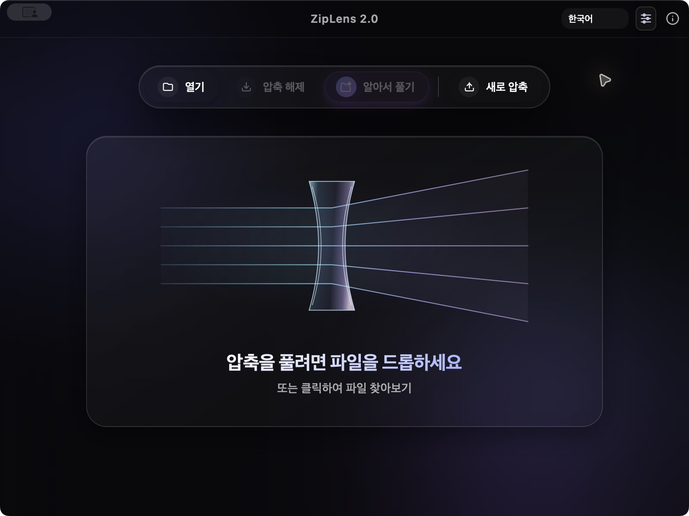
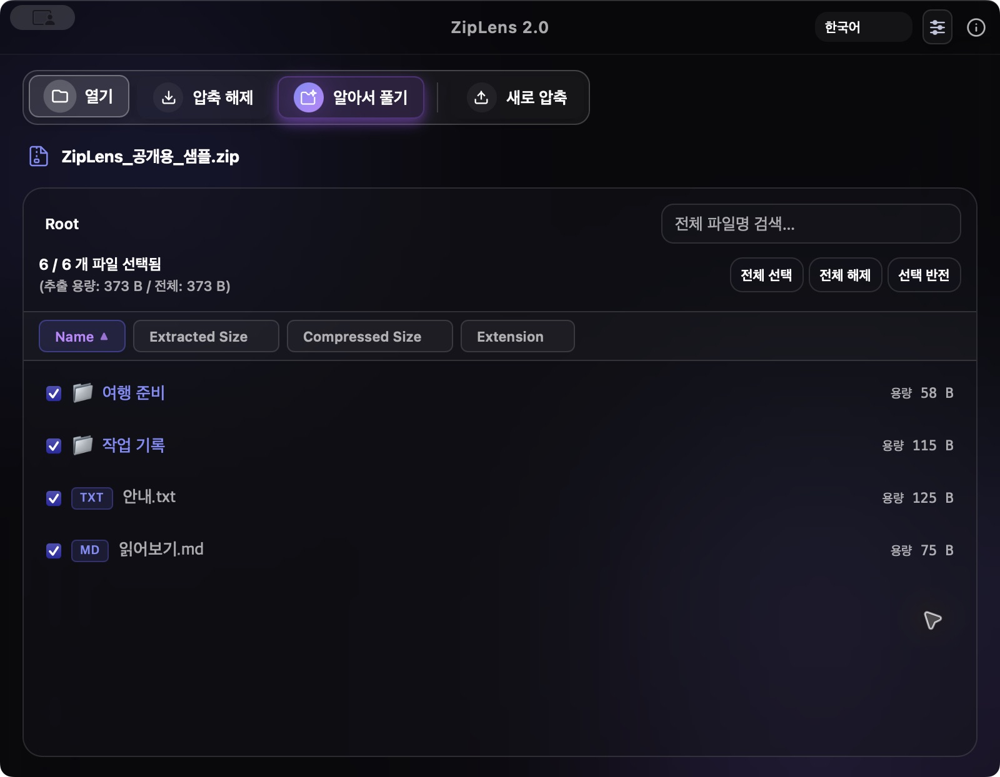
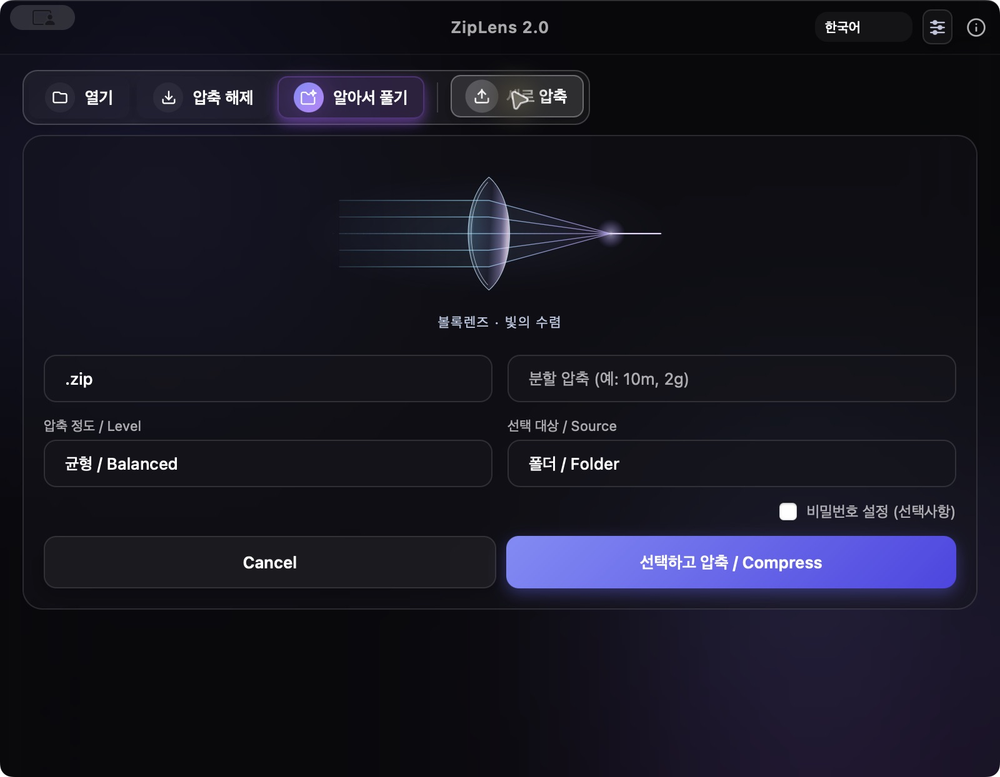

# ZipLens

압축을 풀기 전에 안을 보고, 필요한 파일만 골라 꺼내는 무료 macOS 압축 앱입니다. 압축은 볼록렌즈에 빛이 모이는 모습으로, 압축 해제는 오목렌즈에서 빛이 퍼지는 모습으로 표현합니다.

**최신 프리뷰: ZipLens 2.0.3 · Apple Silicon Mac용**
[다운로드](https://github.com/SeederPowerDrop/ZipLens/releases/tag/v2.0.3) · [업데이트 상세](ZipLens_Astra/docs/RELEASE_2.0.3_KO_EN.md) · [사용법·지원 형식·빌드](ZipLens_Astra/README.md) · [English](#english)

> 현재 배포본은 로컬 ad-hoc 서명만 적용한 프리뷰로, Apple Developer ID 서명·공증을 완료하지 않았습니다. macOS가 실행을 차단할 수 있으며, Intel Mac 실행은 검증하지 않았습니다. [실행 문제 안내](ZipLens_Astra/docs/MACOS_LAUNCH_KO.md)

## 2.0.3에서 달라진 점

- **앱 언어에 맞는 정보창:** 앱에서 선택한 언어로 소개글·제목·버전 표시·후원·라이선스·닫기 버튼을 표시합니다.
- **7개 언어 지원:** 한국어, 영어, 일본어, 중국어, 프랑스어, 스페인어, 아랍어에 맞춰 전환하며 아랍어는 오른쪽에서 왼쪽으로 읽는 방향을 적용합니다.
- **개인 메시지 보존:** `ERW FWS WRG`는 번역하거나 순서를 바꾸지 않고 유지합니다.

[2.0.3 한국어·영어 업데이트 안내](ZipLens_Astra/docs/RELEASE_2.0.3_KO_EN.md)

## 이전 2.0.2에서 달라진 점

- **더 넓어진 파일 목록:** 압축 파일을 열면 상단 도구와 파일 제목을 작게 정돈해 내부 파일을 볼 공간을 확보합니다.
- **찾기와 선택을 한곳에서:** 폴더 경로·검색·전체 선택·선택 해제·정렬을 목록 위에 배치하고, 파일 목록은 따로 스크롤합니다.
- **긴 파일명과 키보드 이동:** 긴 이름에 마우스를 올리면 전체 이름을 볼 수 있고, 폴더 경로 버튼은 키보드로 이동할 수 있습니다.
- **언어 변경 개선:** 언어를 바꿔도 열어 둔 압축 파일명이 유지되며 검색 입력의 접근성 설명도 번역됩니다.
- **화면 표시 안정성:** 목록을 표시할 때 화면을 강제로 숨겼다가 다시 보여 주던 처리를 제거하고, 열린 압축 화면의 애니메이션을 정리했습니다.

2.0.1의 **Finder에서 앱을 처음 시작하며 파일을 열 때 종료되던 오류 수정**도 포함합니다. 자세한 변경·검증 내용은 [업데이트 안내](ZipLens_Astra/docs/RELEASE_2.0.2_KO_EN.md)에 있습니다.

## 앱 화면

**메인 화면** — 압축 파일을 끌어 놓거나 새 압축을 시작합니다.



**파일 미리보기** — 폴더 경로와 검색, 선택한 용량을 확인하며 필요한 항목만 고릅니다.



**압축 설정** — 파일이나 폴더를 고르고 압축 정도·분할·암호 옵션을 설정합니다.



위 스크린샷은 2.0.2 macOS 앱에서 공개용 샘플 자료로 촬영했습니다. 2.0.3 정보창의 언어 변경 화면을 촬영한 이미지는 아닙니다. [스크린샷 안내](ZipLens_Astra/docs/screenshots/README.md)

## 2.0 시리즈의 주요 개선

| 개선 | 사용할 때 달라지는 점 |
|---|---|
| 미리보기와 선택 해제 | 전체 압축을 풀기 전에 한글 파일명·내부 폴더·필요한 용량을 확인합니다. |
| ALZ·EGG 지원 | 목록, 파일 미리보기, 선택 해제를 지원합니다. 생성은 지원하지 않습니다. |
| 원본 파일 보호 | 기존 폴더 전체를 지우지 않고 검증한 파일만 반영하며, 원본·분할 조각 덮어쓰기와 위험한 경로를 검사합니다. |
| ZIP 처리 개선 | ZIP 중앙 목록을 재사용해 반복 읽기를 줄입니다. 조건별 결과는 [성능 기록](ZipLens_Astra/docs/BENCHMARKS_KO.md)에 공개합니다. |
| macOS 기본 앱 설정 | 앱에서 확장자를 선택해 Finder의 기본 열기 앱으로 지정할 수 있습니다. |
| 작업 흐름 정리 | 암호 재입력, 취소, 완료 보고서, Finder에서 보기와 7개 언어를 지원합니다. |

생성 형식은 **ZIP, 7Z, TAR, TAR.GZ, TAR.ZST**입니다. 열기는 별칭을 포함해 **36개 확장자**를 인식합니다. 모든 형식의 모든 변종을 지원·검증했다는 의미는 아니며, [지원 범위와 한계](ZipLens_Astra/README.md#지원-범위)를 확인해 주세요.

## 다운로드와 시작

1. [2.0.3 프리뷰 릴리스](https://github.com/SeederPowerDrop/ZipLens/releases/tag/v2.0.3)에서 `ZipLens_2.0.3_arm64-preview.zip`을 받습니다.
2. 실행 중인 구버전은 ⌘Q로 종료하고, ZIP은 macOS의 아카이브 유틸리티로 풉니다.
3. `ZipLens 2.0.app`을 사용할 위치에 둔 뒤 실행합니다. 기존 설치본을 바꾼다면 먼저 백업하세요.

소스를 실행하려면 **`ZipLens_Astra` 폴더**에서 시작하세요. 저장소 루트의 기존 1.x 프로젝트는 보존되어 있습니다.

```sh
cd ZipLens_Astra
npm ci
npm run tauri dev
```

macOS, Node.js, Rust/Cargo 1.89 이상, Xcode Command Line Tools, Python 3.11 이상이 필요합니다. 전체 빌드·검증·배포 절차는 [개발 안내](ZipLens_Astra/README.md#실행과-빌드)를 참고하세요.

## 기록과 소개

- [변경 이력](ZipLens_Astra/CHANGELOG.md) · [검증 기록](ZipLens_Astra/docs/VALIDATION.md) · [함께 작업한 기록](ZipLens_Astra/docs/WORK_LOG.md)
- [배포·구성요소 라이선스 안내](ZipLens_Astra/docs/DISTRIBUTION_KO.md) · [문제 신고](https://github.com/SeederPowerDrop/ZipLens/issues/new)
- [기존 1.3.0 릴리스](https://github.com/SeederPowerDrop/ZipLens/releases/tag/v1.3.0)

안녕하세요, SeederPowerDrop입니다. macOS에서 편하게 쓸 수 있는 무료 압축 앱을 만들고 싶어 ZipLens를 시작했습니다. 빛을 모으고 퍼뜨리는 렌즈의 성질을 압축과 압축 해제에 담았습니다. 모두 편하게 사용해 주시면 좋겠습니다.

그리고 ERW FWS WRG

---

## English

ZipLens is a free macOS archive app for looking inside archives and extracting just the files you need. Its interface uses a converging convex lens for compression and a diverging concave lens for extraction.

**Current preview: ZipLens 2.0.3 for Apple Silicon.** [Download](https://github.com/SeederPowerDrop/ZipLens/releases/tag/v2.0.3) · [Full update notes in Korean and English](ZipLens_Astra/docs/RELEASE_2.0.3_KO_EN.md)

### What's new in 2.0.3

The About window now follows the selected app language for its introduction, title, version label, support and license controls, and close buttons. It supports Korean, English, Japanese, Chinese, French, Spanish, and Arabic, including right-to-left layout for Arabic. The personal message `ERW FWS WRG` remains unchanged.

### Previous improvements in 2.0.2

- A compact toolbar and archive title leave more room for the file list.
- Folder navigation, search, selection controls and sorting sit above a separately scrolling list.
- Hover over a shortened filename to see its full name; use the keyboard to navigate folder-path buttons.
- Switching languages preserves the loaded archive's filename and translates the search field's accessible label.
- Archive display is more stable after removing the forced hide-and-redisplay step and simplifying loaded-view animations.
- Includes the 2.0.1 fix for a startup crash when opening an archive from Finder while the app is closed.

The screenshots above were captured from the actual 2.0.2 macOS app using public sample files: the home screen, archive browser and compression settings. They do not depict the updated About window in 2.0.3.

### Features and availability

The 2.0 series adds ALZ/EGG extraction and previews, stronger protection for original files, improved ZIP processing, default archive-app settings in macOS, password retries, cancellation, completion reports and seven interface languages. It creates ZIP, 7Z, TAR, TAR.GZ and TAR.ZST archives, and recognizes 36 file extensions including aliases. Support varies by format and variant; ALZ/EGG creation is not supported.

**This preview uses a local ad-hoc signature and has not completed Apple Developer ID signing or notarization. macOS may block it from opening. Intel Mac execution has not been verified.** Download `ZipLens_2.0.3_arm64-preview.zip` from the release page, quit older copies, extract with macOS Archive Utility, and place the app where you want to keep it. The release includes SHA-256 checksums.

### Building and project history

The current app lives in **`ZipLens_Astra/`**; the original 1.x project remains at the repository root. To start development, run `cd ZipLens_Astra`, `npm ci`, then `npm run tauri dev`. Requirements are macOS, Node.js, Rust/Cargo 1.89 or later, Xcode Command Line Tools and Python 3.11 or later. See the [app README](ZipLens_Astra/README.md), [validation record](ZipLens_Astra/docs/VALIDATION.md), and [changelog](ZipLens_Astra/CHANGELOG.md) for details.

Created by [SeederPowerDrop](https://github.com/SeederPowerDrop) to make working with archives on a Mac more convenient.
